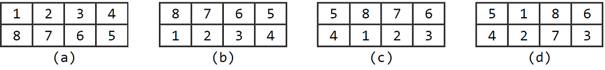

# 2D-Cube-problem

ZC神最擅长逻辑推理，一日，他给大家讲述起自己儿时的数字玩具。
该玩具酷似魔方，又不是魔方。具体来说，它不是一个3 * 3 * 3的结构，而是4 * 2的结构。

A． 交换上下两行。比如，图(a)经此变换后结果如图(b)所示。
B． 循环右移（ZC神从小就懂得这是什么意思的）。比如，图(b)经此变换后结果如图(c)所示。
C． 中心顺时针旋转。比如，图(c)经此变换后结果如图(d)所示。
ZC神自小就是这方面的天才，他往往是一只手还没揩干鼻涕，另一只手已经迅速地将处于任意状态的玩具复原至如图(a)所示的初始状态。物质极其匮乏的当年，ZC神只有一个这样的玩具；物质极大丰富的今天，你已拥有多个处于不同状态的玩具。现在，就请将它们全部复原吧。
